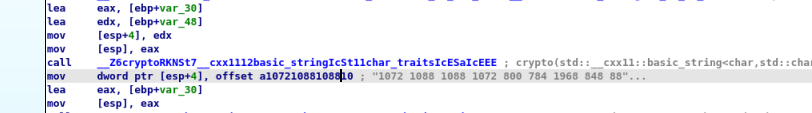
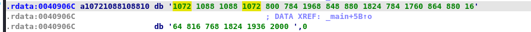
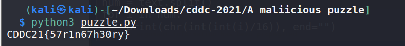

> Shifting (300 points)
>
> The recently captured file server contained a mysterious file that was probably used for getting access to other resources. Can you find the correct password?

The challenge provides us with a "Shifting.exe" executable file.

Opening the executable file with ida-free, we found a potential flag.

<p align="center">
    <br/>
</p>

We can get the full flag by navigating to its address.

<p align="center">
    <br/>
</p>

Looking at the number, we noticed some pattern:
1072 / 16 = 67 (which is C in ascii), 1088 / 16 = 68 (which is D in ascii)

So, the first four number is CDDC.

We created a script to automate this process:
```
text = "1072 1088 1088 1072 800 784 1968 848 880 1824 784 1760 864 880 1664 816 768 1824 1936 2000"
num = text.split()
for i in num:
    print(chr(int(int(i)/16)), end="") 
```
<p align="center">
    <br/>
</p>

> Flag: CDDC21{57r1n67h30ry}