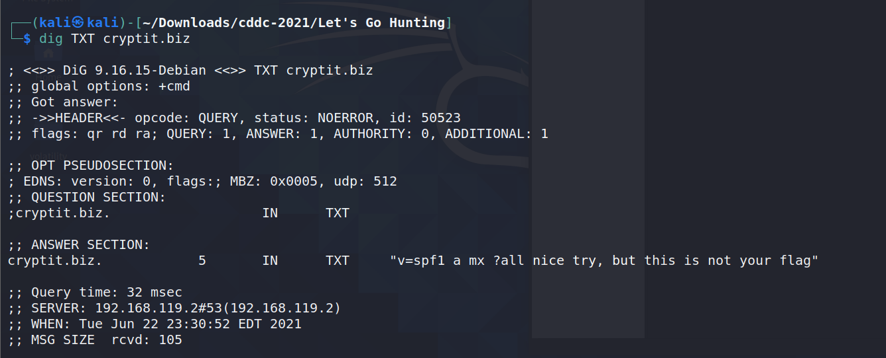
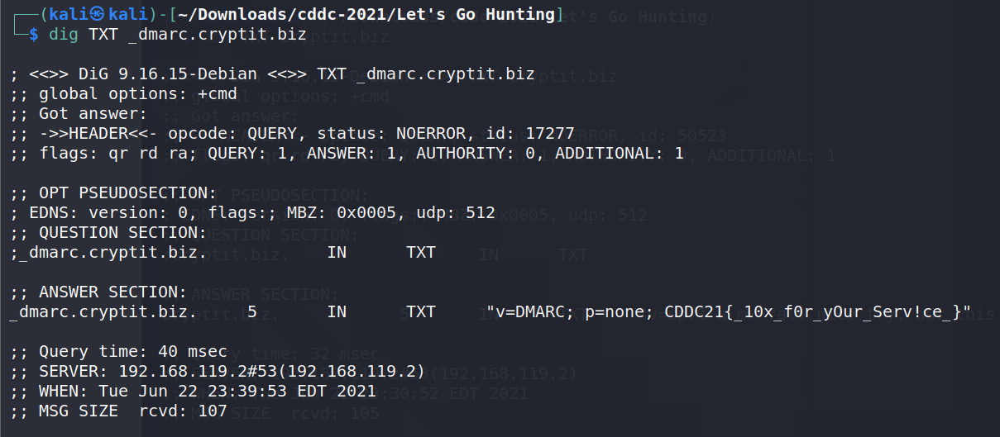

> Broken System
>
> The CryptIT Banking and Consulting company suspects that the GlobalDominationCorporation is attacking its email systems. They need your help to fix the misconfiguration.

Since the challenge is about email, we look into SPF, DKIM and DMARC (email security protocols) misconfigurations.

We look into SPF:  
`$ dig TXT cryptit.biz`

     

Next, we look into DMARC: 
`$ dig TXT _dmarc.cryptit.biz`

     

> Flag: CDDC21{_10x_f0r_yOur_Serv!ce_}
