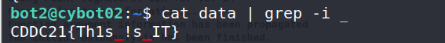

> Scrambled Eggs (200 points)
>
> Now you're asking me what are all of these strings? This file looks like scrambled aggs to me. Those crazy Cybots
always try to make it harder.

There is a "data" file which contains a list of random strings.

As all flags contain underscore character, we can search for strings that contain underscore character.

`$ cat data | grep -i _`

     

> Flag: CDDC21{Th1s_!s_IT}