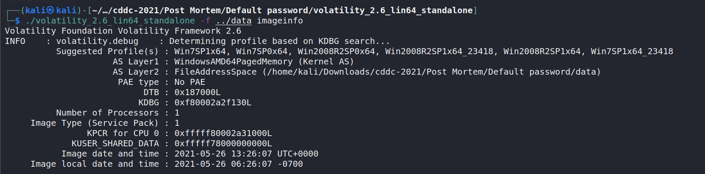
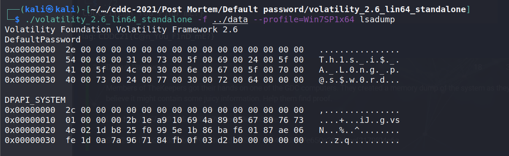

> Default Password
>
> Members of TheKeepers got their hands on one of the GDC computers. They created a memory dump of the system as they believe it might contain some juicy information. Help them find proof.

The challenge provides us a "data" file (a memory dump)

Get the profile suggestions:  
`$ ./volatility_2.6_lin64_standalone -f ../data imageinfo`

     

Since the title of the challenge is related to password, we try to dump the password stored in the memory dump.

`$ ./volatility_2.6_lin64_standalone -f ../data --profile=Win7SP1x64 lsadump`

     

Since the title of the challenge is "Default Password", we guess that the flag is "Th1s_i$_A_L0ng_p@s$w0rd".

> Flag: CDDC21{Th1s_i$_A_L0ng_p@s$w0rd}