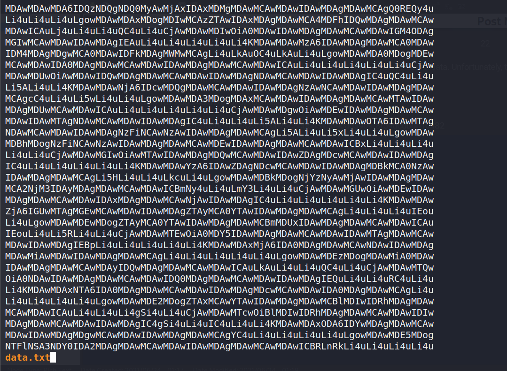
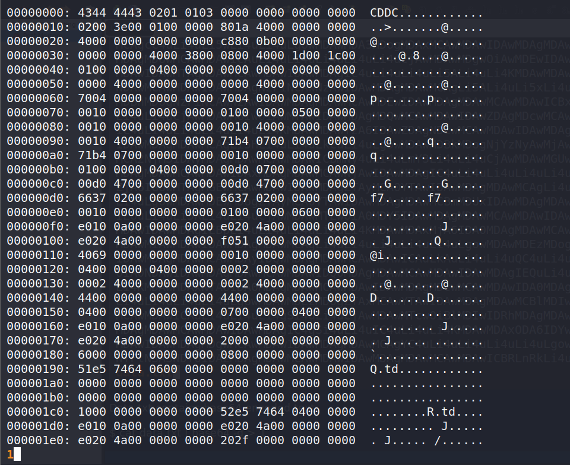
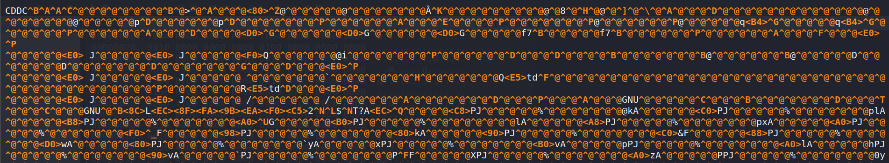
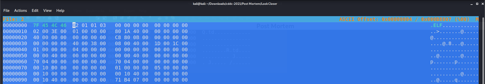
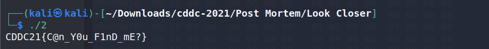

> Look Closer
>
> The resistance managed to find a suspicious file. They believe it contains some useful data. Unfortunately, they weren't able to retrieve it. Help them find what they are looking for.

The challenge provides us a "data.txt" file.

     

The content looks like base64 encoded text.

`$ cat data.txt | base64 -d > 1`

After base64 decode the file, we got a hexdump.

     

Next, we convert the hexdump into binary.

`$ xxd -r 1 > 2`

     

It seems like the file signature is not correct.

Modify the file signature: 
`$ hexeditor 2`

We change the file signature to .ELF instead of CDDC

     

We got the flag when we execute the binary.

     

> Flag: CDDC21{C@n_Y0u_F1nD_mE?}